## 模型 llava-Qwen2-7B-Instruct-Chinese-CLIP 增强中文文字识别能力和表情包内涵识别能力，达到gpt4o、claude-3.5-sonnet的水平！


### 完整模型下载</br>
#### 更新日志
[24/07/22] 更新《llava-Qwen2-7B-Instruct-Chinese-CLIP训练手册》，总结了最近尝试的不同训练组合及其图像识别效果。重点描述以下两种组合：

1. 实验编号13：
   - 模型：Qwen2-7B-Instruct
   - 视觉编码器：OFA-Sys/chinese-clip-vit-huge-pathc14
   - 数据集：数据集v1改进版（在原v1基础上，增加了Claude 3.5 Sonnet模型对meme和ChineseBQB的识别数据）
   - 效果：表情包问答输出效果最佳，但纯文字图片识别效果一般

2. 实验编号12（两阶段训练）：
   第一阶段：
   - 模型：Qwen2-7B-Instruct
   - 视觉编码器：OFA-Sys/chinese-clip-vit-large-pathc14-336px
   - 数据集：数据集v2

   第二阶段：
   - 使用数据集v1改进版对第一阶段模型进行微调
   - 效果：表情包问答输出效果良好，纯文字识别效果最佳。但由于数据集中的文字大多为单行，对多行文字图像的识别仅能返回第一行结果。

详细信息请参阅《llava-Qwen2-7B-Instruct-Chinese-CLIP训练手册.xlsx》。

[24/07/19] 上传模型v2：https://huggingface.co/REILX/v1llava-Qwen2-7B-Instruct-Chinese-CLIP-v2, 对比上一代模型REILX/llava-Qwen2-7B-Instruct-Chinese-CLIP，训练数据扩大至四种中文数据集，图片总数扩大47倍，文字总数扩大5倍。

[24/07/09] 上传模型v1：https://huggingface.co/REILX/llava-Qwen2-7B-Instruct-Chinese-CLIP

### 模型结构</br>
llava-Qwen2-7B-Instruct-Chinese-CLIP = Qwen/Qwen2-7B-Instruct + multi_modal_projector + OFA-Sys/chinese-clip-vit-large-patch14-336px</br>

### 微调模块
- vision_tower和language_model的q_proj, k_proj, v_proj, o_proj, gate_proj, up_proj, down_proj部分进行lora训练</br>
- mmp层全量训练</br>

### 微调</br>
#### v1
- lora_r=32,lora_alpha=64,num_train_epochs=5,per_device_train_batch_size=1,gradient_accumulation_steps=8,high_lr=1e-3,low_lr=2e-5,model_max_length=2048.</br>
- 设备：8*A800</br>
- 训练时长：5小时12分钟

#### v2
- lora_r=32,lora_alpha=64,num_train_epochs=3,per_device_train_batch_size=1,gradient_accumulation_steps=8,high_lr=5e-4,low_lr=1e-5,model_max_length=2048.</br>
- 设备：8*A800</br>
- 训练时长：68小时06分钟

### 数据集</br>
#### v1
- 使用gemini-1.5-pro, gemini-1.5-flash, yi-vision, gpt4o,claude-3.5-sonnet模型描述emo-visual-data和ChineseBQB数据集。</br>
文本描述信息通过[text-description-of-the-meme](https://huggingface.co/datasets/REILX/text-description-of-the-meme) 下载</br>
图像可通过[emo-visual-data](https://github.com/LLM-Red-Team/emo-visual-data), [ChineseBQB](https://github.com/zhaoolee/ChineseBQB)下载</br>
图片数据总量1.8G，约10835张中文表情包图片。文字总量42Mb，约24332个图像文本对描述信息。

#### v2
- 使用gemini-1.5-pro, gemini-1.5-flash, yi-vision, gpt4o,claude-3.5-sonnet模型描述emo-visual-data和ChineseBQB数据集。</br>
文本描述信息通过[text-description-of-the-meme](https://huggingface.co/datasets/REILX/text-description-of-the-meme) 下载</br>
图像可通过[emo-visual-data](https://github.com/LLM-Red-Team/emo-visual-data), [ChineseBQB](https://github.com/zhaoolee/ChineseBQB)下载</br>
图片数据总量1.8G，约10835张中文表情包图片。文字总量42Mb，约24332个图像文本对描述信息。
- [priyank-m/chinese_text_recognition](https://huggingface.co/datasets/priyank-m/chinese_text_recognition)</br>
图片数据总量2.0Gb，约500000张图片。文字总量207Mb，约500000个图像文本对描述信息。
- [SWHL/ChineseOCRBench](https://huggingface.co/datasets/SWHL/ChineseOCRBench)</br>
图片数据总量134Mb，约3410张图片。文字总量1.3Mb，约3410个图像文本对描述信息。
- [fly0331/ChineseTest](https://huggingface.co/datasets/fly0331/ChineseTest)</br>
图片数据总量530Mb，约6247张图片。文字总量5.4Mb，约6247个图像文本对描述信息。


### 效果展示</br>
以下测试结果显示模型能识别图像中的文字信息，且能正确识别表情包想要表达的内涵。对比[REILX/llava-1.5-7b-hf-meme-lora](https://huggingface.co/REILX/llava-1.5-7b-hf-meme-lora)模型中也测试了原始llava-1.5-7b-hf模型的输出，模型无法正确识别图像中的文本信息。</br>
**以下9张图片为llava-Qwen2-7B-Instruct-Chinese-CLIP-v2模型的识别效果**</br>

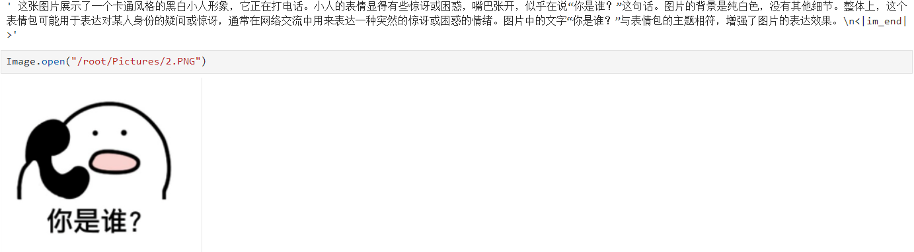
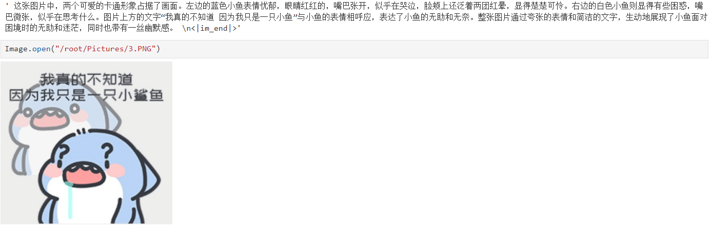
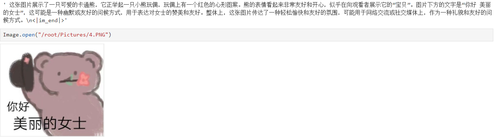
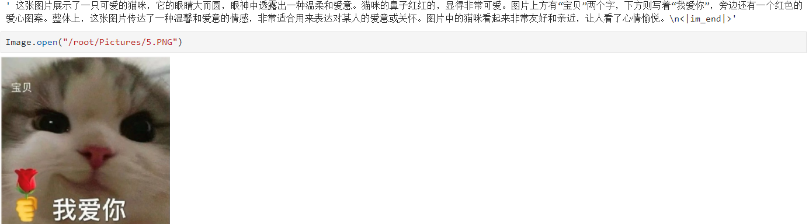
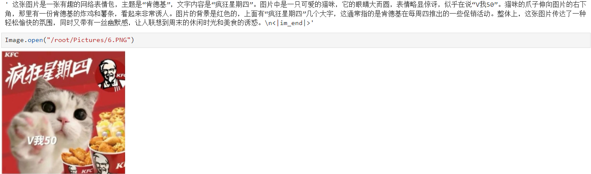
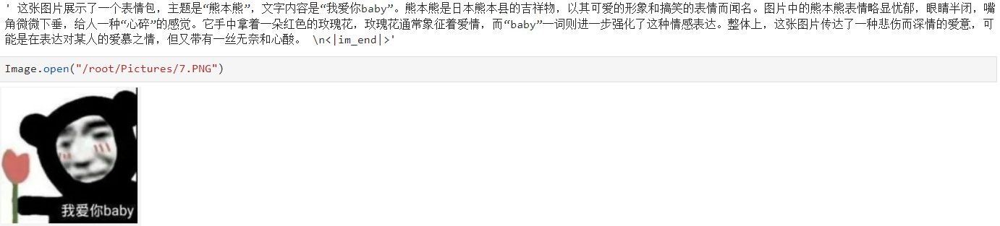
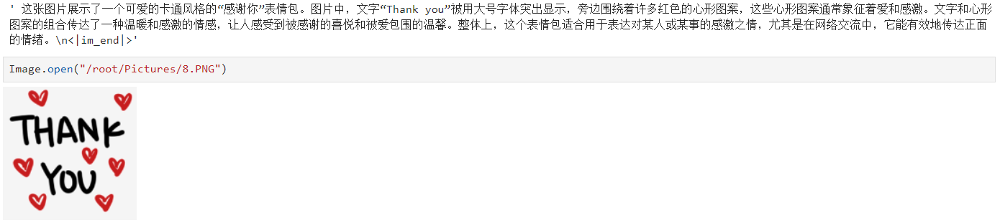
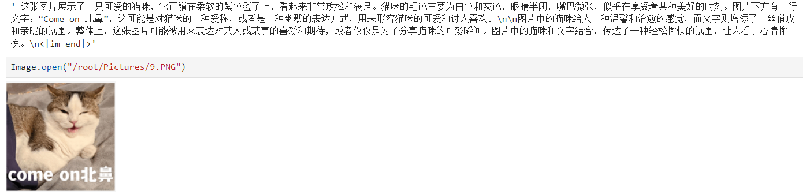

**以下6张图片为llava-Qwen2-7B-Instruct-Chinese-CLIP模型的识别效果**</br>
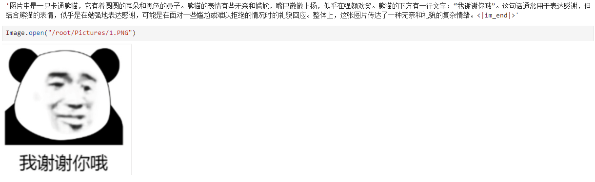
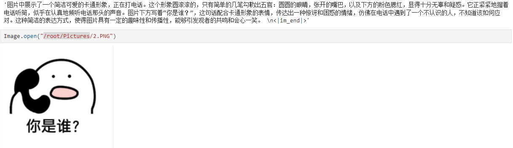
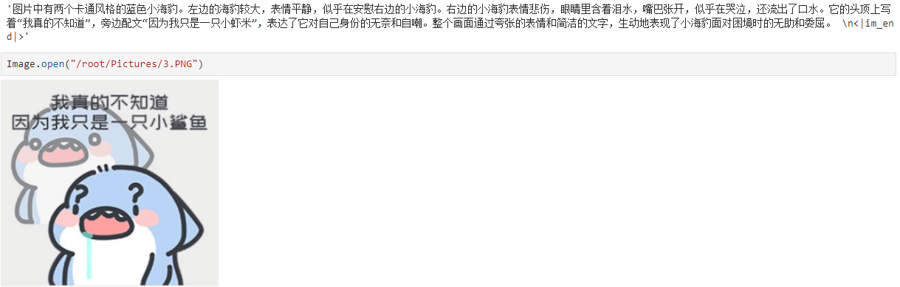
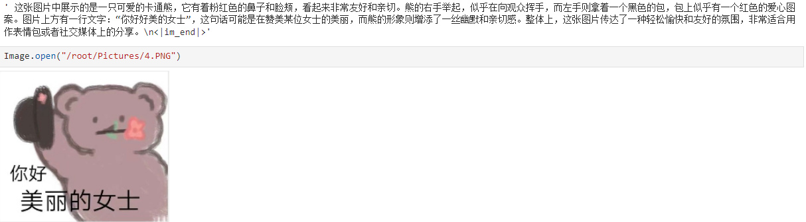
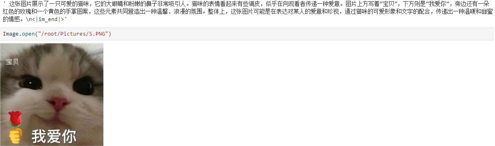
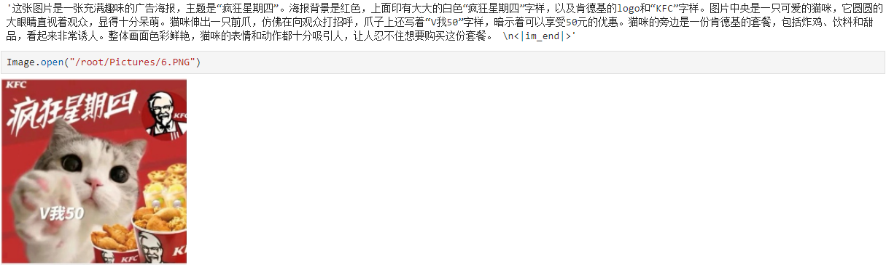
</br>

**以下6张图片为Qwen/Qwen2-7B-Instruct + multi_modal_projector + openai/clip-vit-large-patch14-336模型训练后的识别效果**</br>
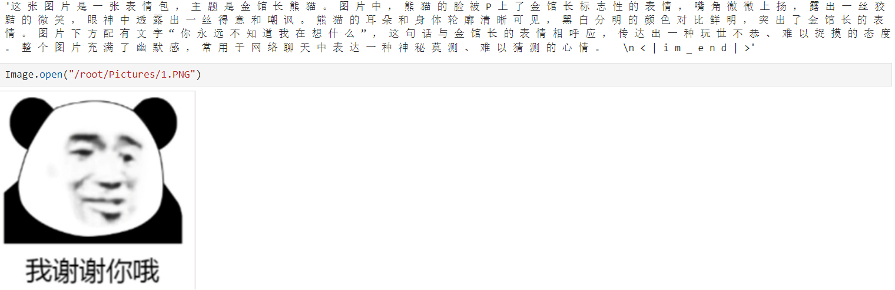
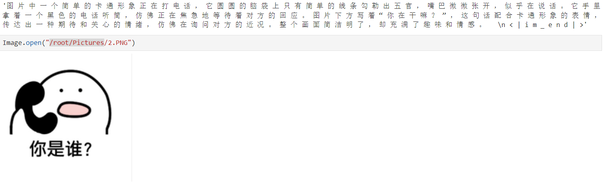
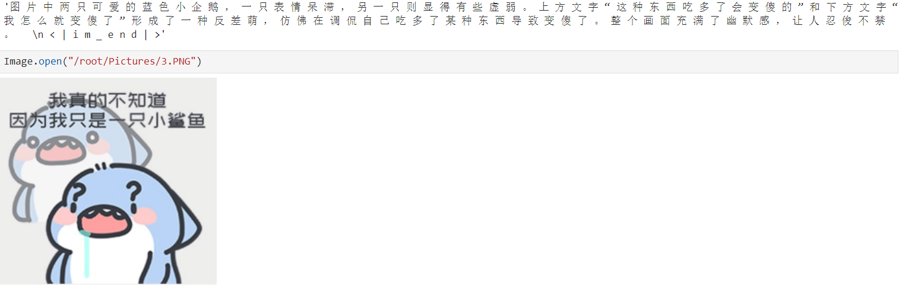
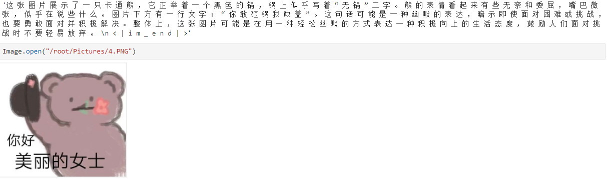
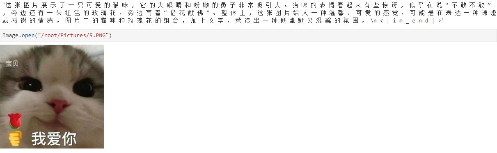
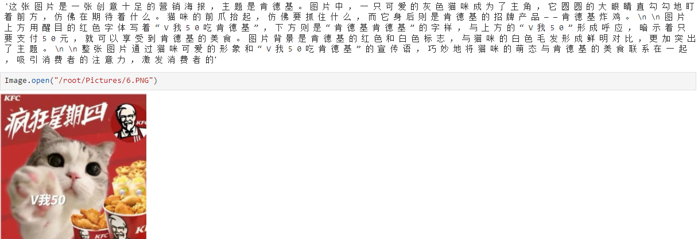
</br>

**以下3张图为gpt4o的识别效果**</br>
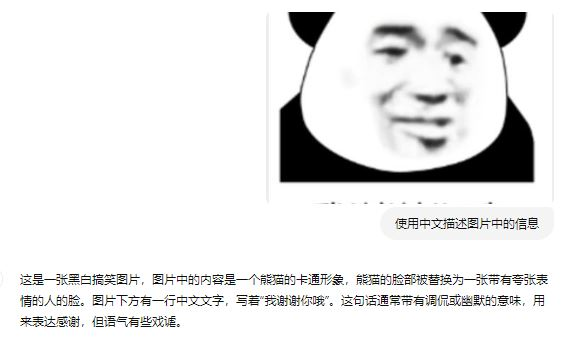
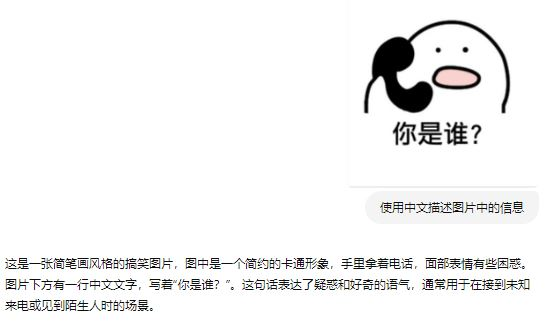
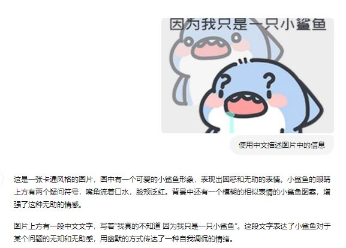

## 项目代码：</br>
基础模型生成代码和训练代码可参考项目：https://github.com/yuanzhoulvpi2017/zero_nlp/tree/main/train_llava</br>
本项目基于原代码进行优化，主要改进包括：
1. **新增warmup功能，并针对不同模块采用差异化学习率，加速了multi_modal_projector的收敛速度。**  这一改进有效提升了模型训练效率。
2. **针对训练过程中出现的报错情况，对部分代码进行了优化，增强了代码稳定性。**  
3. **用户只需修改run.sh中的参数，即可直接执行训练。**  简化了操作流程，提升了用户体验。

合并模型代码，合并模型之后将add_tokens.json,merge.txt,preprocessor_config.json,specital_token_map.json,tokenizer.json,vocab.json文件复制到"/保存的完整模型路径"。
```python
import torch
from peft import PeftModel, LoraConfig
from transformers import LlavaForConditionalGeneration
model_name = "/替换为你的基础模型路径"
LORA_R = 32
LORA_ALPHA = 64
LORA_DROPOUT = 0.05
TARGET_MODULES = ["q_proj", "k_proj", "v_proj", "o_proj", "gate_proj", "up_proj", "down_proj"]
lora_config = LoraConfig(
    r=LORA_R,
    lora_alpha=LORA_ALPHA,
    target_modules=TARGET_MODULES,
    lora_dropout=LORA_DROPOUT,
    bias="none",
    task_type="CAUSAL_LM",
    modules_to_save=["multi_modal_projector"],
) 
model = LlavaForConditionalGeneration.from_pretrained(model_name)
model = PeftModel.from_pretrained(model, "/替换为你的lora模型路径", config=lora_config, adapter_name='lora')

model.cpu()
model.eval()
base_model = model.get_base_model()
base_model.eval()
model.merge_and_unload()
base_model.save_pretrained("/保存的完整模型路径")
```

推理代码
```python
from transformers import LlavaForConditionalGeneration, AutoProcessor
import torch
from PIL import Image

raw_model_name_or_path = "/保存的完整模型路径"
model = LlavaForConditionalGeneration.from_pretrained(raw_model_name_or_path, device_map="cuda:0", torch_dtype=torch.bfloat16)
processor = AutoProcessor.from_pretrained(raw_model_name_or_path)
model.eval()

def build_model_input(model, processor):
    messages = [
        {"role": "system", "content": "You are a helpful assistant."},
        {"role": "user", "content": "<image>\n 使用中文描述图片中的信息"}
    ]
    prompt = processor.tokenizer.apply_chat_template(
        messages, tokenize=False, add_generation_prompt=True
    )
    image = Image.open("01.PNG")
    inputs = processor(text=prompt, images=image, return_tensors="pt", return_token_type_ids=False)
    
    for tk in inputs.keys():
        inputs[tk] = inputs[tk].to(model.device)
    generate_ids = model.generate(**inputs, max_new_tokens=200)
    
    generate_ids = [
        oid[len(iids):] for oid, iids in zip(generate_ids, inputs.input_ids)
    ]
    gen_text = processor.batch_decode(generate_ids, skip_special_tokens=False, clean_up_tokenization_spaces=False)[0]
    return gen_text
build_model_input(model, processor)
```

### TODO
- [x] llava项目基于二阶段训练，先进行Pretraining，再进行Fine-tuning。Pretraining训练的部分：multi_modal_projector，
Fine-tuning训练的部分：language_model + multi_modal_projector。本项目后续基于上述思路进行优化，比较两者差异。
(7/22已完成，详情参考《llava-Qwen2-7B-Instruct-Chinese-CLIP训练手册》)
- [ ] 对llava-Qwen2-7B-Instruct-Chinese-CLIP模型进行更全面测评。

### 致谢

本项目受益于 [train_llava](https://github.com/yuanzhoulvpi2017/zero_nlp/tree/main/train_llava)、[ChineseBQB](https://github.com/zhaoolee/ChineseBQB)、[emo-visual-data](https://github.com/LLM-Red-Team/emo-visual-data)，感谢以上诸位作者的付出。
